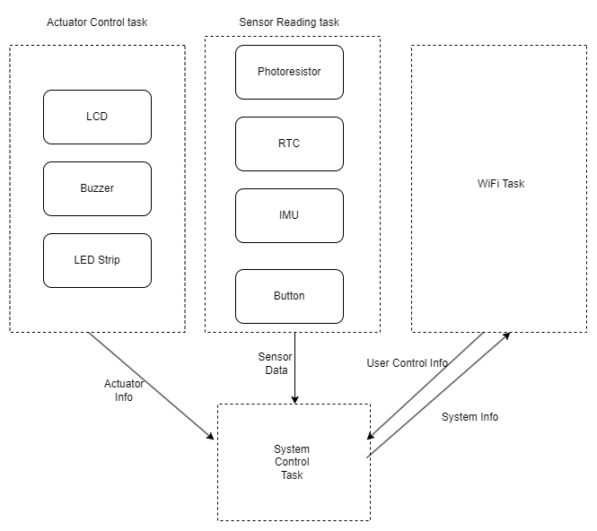
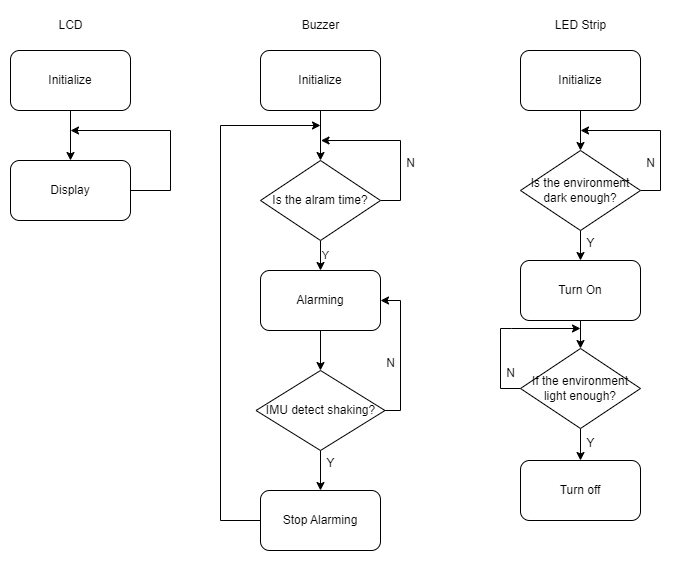
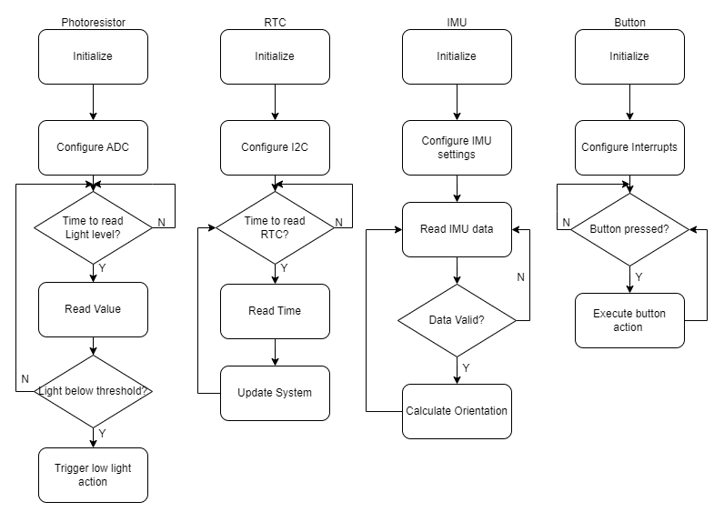
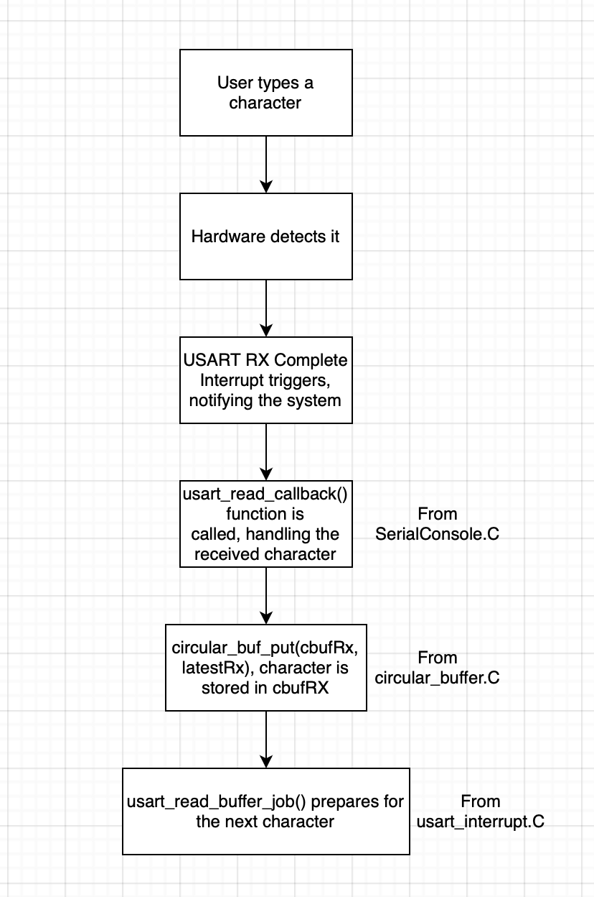
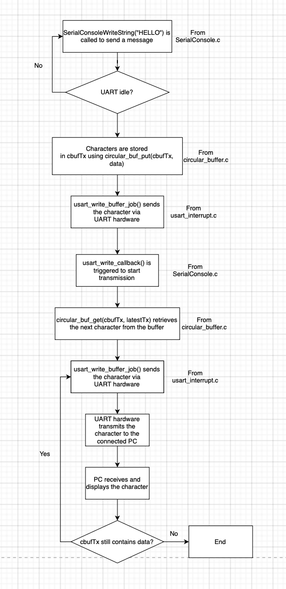
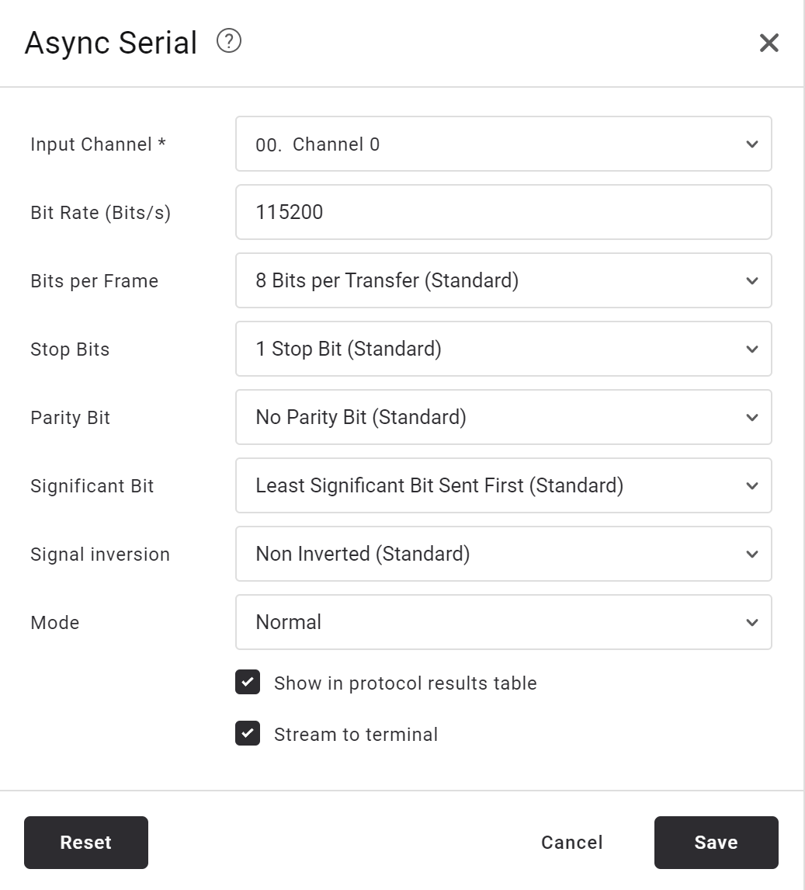
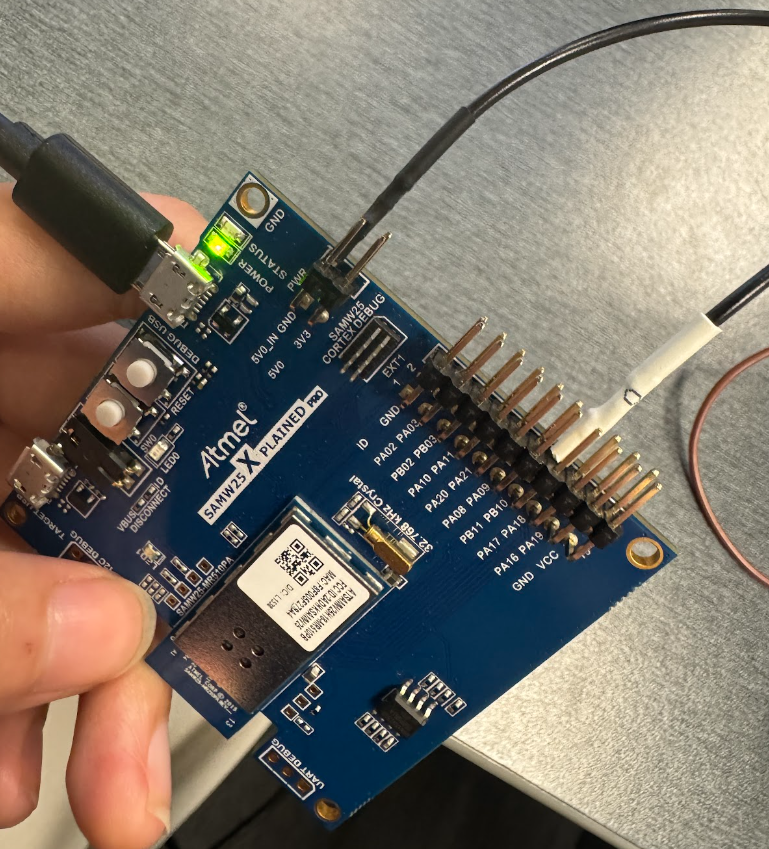
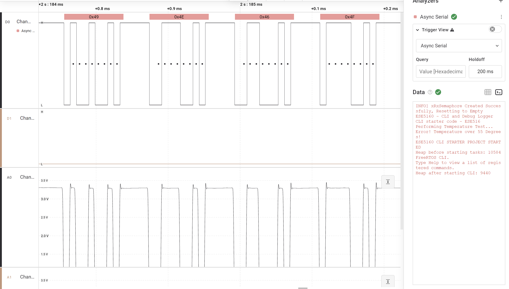
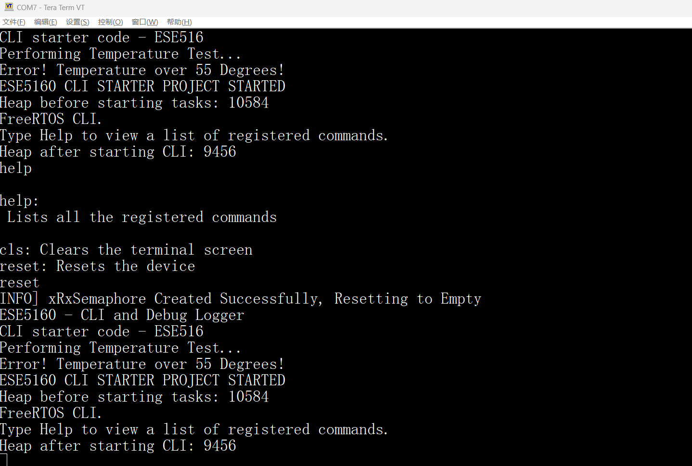
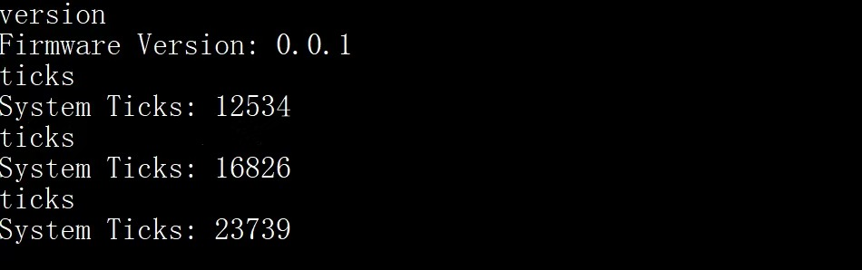

# a07g-exploring-the-CLI

* Team Number: T03
* Team Name: Super Hotpot
* Team Members: Lixi Jiang, Jingyu Hua
* GitHub Repository URL: https://github.com/ese5160/final-project-a07g-a14g-t03-hotpot.git
* Description of test hardware: (development boards, sensors, actuators, laptop + OS, etc)

# Part1: Software Architecture

## HRS

### Overview
A desktop companion device based on SAMW25 microcontroller, featuring a 4-inch LCD display, IMU, photoresistor, LED strip, RTC, and powered by a Li-Ion battery.

### Definitions, Abbreviations
LCD: Liquid Crystal Display
RTC: Real-time Clock
IMU: Inertial measurement unit

### Functionality
HRS 01 - Project shall be based on SAMW25 microcontroller operating at 3.7V from Li-Ion battery

HRS 02 - A 4-inch LCD should be used for user interface.

HRS 03 - An IMU shall communicate via I2C bus for shake detection and gaming input

HRS 04 - A photoresistor shall be used for ambient light detection

HRS 05 - A LED strip shall provide ambient lighting, controlled by single GPIO pin

HRS 06 - Three tactile buttons shall connect directly to GPIO pins for user input

HRS 07 - System shall include battery management and voltage regulation circuitry for 3.7V Li-Ion battery

HRS 08 - A buzzer shall be used for alarm and game sounds

HRS 09 - DS3231 RTC module shall communicate via I2C bus for accurate timekeeping

## SRS

### Overview
Multithreaded embedded software system managing time display, sensor monitoring, user interface, cloud connectivity.

### Functional Requirements
SRS 01 - The system shall display the current time fetched from the RTC module.

SRS 02 - The system shall display real-time temperature information from online weather API.

SRS 03 - The user shall be able to add, edit, and delete to-do items via the LCD interface.

SRS 04 - Shaking the device several times with significant motion, detected via IMU, will dismiss the alarm.

SRS 05 - The system shall implement a multi-level menu structure navigable via three side buttons.

SRS 06 - The system shall support simple games (e.g., obstacle avoidance) controlled via IMU or buttons.

SRS 07 - The system shall adjust LCD brightness based on ambient light detected by photoresistor. When ambient light falls below a certain threshold, the LED strip shall activate with colorful patterns.

SRS 08 - Users shall set countdown timers with alarm sound at the end. Shaking the device will also dismiss the timer alarm.

SRS 09 - GUI shall update display at minimum 30Hz refresh rate.

SRS 10 - The system shall respond to user input within 1s.

SRS 11 - Alarm and timer accuracy shall be within 1 second.

# Part2: Understanding the Starter Code

**1. What does “InitializeSerialConsole()” do? In said function, what is “cbufRx” and “cbufTx”? What type of data structure is it?**

The function InitializeSerialConsole() initializes the serial console by setting up buffers for receiving and transmitting data, configuring the USART, setting interrupt priority, and starting the reception of data. cbufRx and cbufTx are variables that store pointers to circular buffers used for handling incoming (RX) and outgoing (TX) serial data. They are "ring buffers". Data structure for them is FIFO.

**2. How are “cbufRx” and “cbufTx” initialized? Where is the library that defines them (please list the C file they come from).**

They are initialized using circular_buf_init(). The function takes two arguments:
1. A pointer to the memory buffer (rxCharacterBuffer for RX and txCharacterBuffer for TX).
2. The size of the buffer (RX_BUFFER_SIZE for RX and TX_BUFFER_SIZE for TX).
It returns a pointer to a circular buffer structure, which is assigned to cbufRx and cbufTx. 
They are defined in "SerialConsole.c".

**3. Where are the character arrays where the RX and TX characters are being stored at the end? Please mention their name and size.**

RX characters are stored in the "rxCharacterBuffer[ ]", and the size is RX_BUFFER_SIZE (which is defined as 512 bytes). TX characters are stored in the "txCharacterBuffer[ ]", and the size is TX_BUFFER_SIZE (which is defined as 512 bytes).

**4. Where are the interrupts for UART character received and UART character sent defined?**

They are defined in usart_interrupt.c. 
The receive and send interrupt is triggered inside the function: void _usart_interrupt_handler(uint8_t instance);

**5. What are the callback functions that are called when: A character is received? (RX), A character has been sent? (TX)**

Character Received(RX): 
usart_read_callback();
Character Sent(TX): 
usart_write_callback().

**6. Explain what is being done on each of these two callbacks and how they relate to the cbufRx and cbufTx buffers.**

usart_read_callback() (Receiving Data, RX):
Step 1: When a character is received via UART, this function is triggered.
Step 2: The received character (stored in latestRx) is placed into cbufRx, which is a circular buffer that holds incoming data.
Step 3: If the buffer is not full, it starts another UART read operation to keep receiving new characters continuously.
usart_read_callback() stores received characters in cbufRx.

usart_write_callback() (Transmitting Data, TX):
Step 1: When the UART finishes transmitting a character, this function is triggered.
Step 2: It checks cbufTx, the circular buffer for outgoing data.
Step 3: If there is more data to send, it retrieves the next character from cbufTx and sends it via UART.
Step 4: The process continues until all characters in cbufTx are sent.
usart_write_callback() retrieves characters from cbufTx and sends them.

**7. Draw a diagram that explains the program flow for UART receive – starting with the user typing a character and ending with how that characters ends up in the circular buffer “cbufRx”. Please make reference to specific functions in the starter code.**

**8. Draw a diagram that explains the program flow for the UART transmission – starting from a string added by the program to the circular buffer “cbufTx” and ending on characters being shown on the screen of a PC (On Teraterm, for example). Please make reference to specific functions in the starter code.**

**9. What is done on the function “startStasks()” in main.c? How many threads are started?**

The function StartTasks() is initializes application tasks in the FreeRTOS system. It prints available heap memory before starting tasks, creates a CLI (Command Line Interface) task using xTaskCreate(), and prints available heap memory after starting the CLI task.
Only one thread is created: vCommandConsoleTask (CLI Task).

# Part3: Debug Logger Module

Please review LogMessage() function in SerialConsole.c.

# Part4: Wiretap the convo!

**1. What nets must you attach the logic analyzer to?**

TX (Transmit): SERCOM4_PAD2
RX (Receive): SERCOM4_PAD3
GND (Common Ground)

**2. Where on the circuit board can you attach / solder to?**

PB10(TX), PB11(RX) and GND

**3. What are critical settings for the logic analyzer?**

Channel 0 connect with PB10 and GND.

Capture file path: ./Session 0.sal

# Part5: Complete the CLI

See uploaded code.

# Part6: Add CLI commands

See uploaded code.

