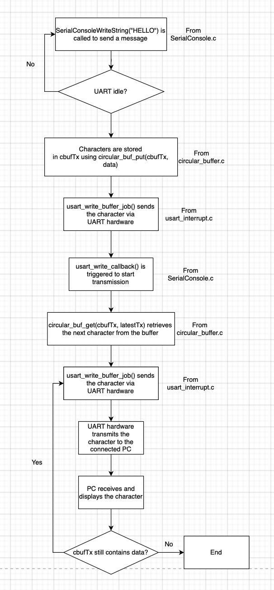

# a07g-exploring-the-CLI

* Team Number: T03
* Team Name: Super Hotpot
* Team Members: Lixi Jiang, Jinyu Hua
* GitHub Repository URL: https://github.com/ese5160/final-project-a07g-a14g-t03-hotpot.git
* Description of test hardware: (development boards, sensors, actuators, laptop + OS, etc)

# Part1: Software Architecture

# Part2: Understanding the Starter Code

**1. What does “InitializeSerialConsole()” do? In said function, what is “cbufRx” and “cbufTx”? What type of data structure is it?**

The function InitializeSerialConsole() initializes the serial console by setting up buffers for receiving and transmitting data, configuring the USART, setting interrupt priority, and starting the reception of data. cbufRx and cbufTx are variables that store pointers to circular buffers used for handling incoming (RX) and outgoing (TX) serial data. They are "ring buffers".

**2. How are “cbufRx” and “cbufTx” initialized? Where is the library that defines them (please list the C file they come from).**

They are initialized using circular_buf_init(). The function takes two arguments:
1. A pointer to the memory buffer (rxCharacterBuffer for RX and txCharacterBuffer for TX).
2. The size of the buffer (RX_BUFFER_SIZE for RX and TX_BUFFER_SIZE for TX).
It returns a pointer to a circular buffer structure, which is assigned to cbufRx and cbufTx. 
They are defined in "SerialConsole.c".

**3. Where are the character arrays where the RX and TX characters are being stored at the end? Please mention their name and size.**

RX characters are stored in the "rxCharacterBuffer", and the size is RX_BUFFER_SIZE (which is defined as 512 bytes). TX characters are stored in the "txCharacterBuffer", and the size is TX_BUFFER_SIZE (which is defined as 512 bytes).

**4. Where are the interrupts for UART character received and UART character sent defined?**

They are defined in usart_interrupt.c. 
The receive interrupt is triggered inside the function: void _usart_interrupt_handler(uint8_t instance);
The send interrupt is triggered inside the function: void _usart_interrupt_handler(uint8_t instance).

**5. What are the callback functions that are called when: A character is received? (RX), A character has been sent? (TX)**

Character Received(RX): 
usart_read_callback();
Character Sent(TX): 
usart_write_callback().

**6. Explain what is being done on each of these two callbacks and how they relate to the cbufRx and cbufTx buffers.**

usart_read_callback() (Receiving Data, RX):
Step 1: When a character is received via UART, this function is triggered.
Step 2: The received character (stored in latestRx) is placed into cbufRx, which is a circular buffer that holds incoming data.
Step 3: If the buffer is not full, it starts another UART read operation to keep receiving new characters continuously.
usart_read_callback() stores received characters in cbufRx.

usart_write_callback() (Transmitting Data, TX):
Step 1: When the UART finishes transmitting a character, this function is triggered.
Step 2: It checks cbufTx, the circular buffer for outgoing data.
Step 3: If there is more data to send, it retrieves the next character from cbufTx and sends it via UART.
Step 4: The process continues until all characters in cbufTx are sent.
usart_write_callback() retrieves characters from cbufTx and sends them.

**7. Draw a diagram that explains the program flow for UART receive – starting with the user typing a character and ending with how that characters ends up in the circular buffer “cbufRx”. Please make reference to specific functions in the starter code.**

**8. Draw a diagram that explains the program flow for the UART transmission – starting from a string added by the program to the circular buffer “cbufTx” and ending on characters being shown on the screen of a PC (On Teraterm, for example). Please make reference to specific functions in the starter code.**

**9. What is done on the function “startStasks()” in main.c? How many threads are started?**

The function StartTasks() is initializes application tasks in the FreeRTOS system. It prints available heap memory before starting tasks, creates a CLI (Command Line Interface) task using xTaskCreate(), and prints available heap memory after starting the CLI task.
Only one thread is created: vCommandConsoleTask (CLI Task).

# Part3: Debug Logger Module

Please review LogMessage() function in SerialConsole.c.

# Part4: 